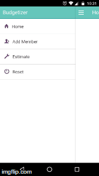

# budgetizer_ionic

Budgetizer : Simple Trip Organizer Android App.

 

App is developed by MaddyMastering using ionic.

Steps to run this app on your android phone.

1. git clone https://github.com/MaddyMastering/budgetizer_ionic.git 

2. npm install

3. bower install 

4. grunt platform:add:android

5. connect ur phone to laptop in debugging mode.

6. grunt run:android.

That's it. you are done.
